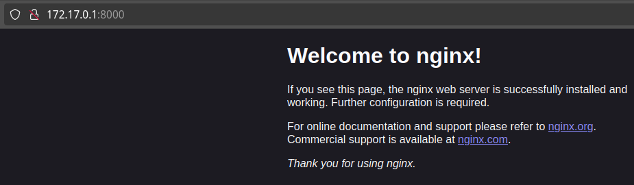
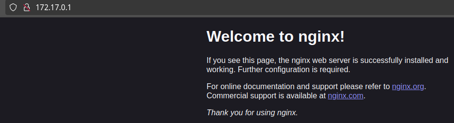

>### Небольшое предисловие.
>_В данном "гайде" собран минимум знаний и команд, чтобы просто не потеряться в докере, а так же понять как с ним работать, этого недостаточно, чтобы прозвать себя великим знатоком докера, но более чем достаточно для комфортной работы, так же можно заглянуть за "техническими примерами" в /src/some_tips.md._

## Оглавление.
[Глава 1. Базовые команды.](#глава-1-базовые-команды)  
[Глава 2. Управление портами.](#глава-2-управление-портами)  
[Глава 3. Переменные окружения.](#глава-3-переменные-окружения-docker)  
[Глава 4. Хранилище docker'a](#глава-4-хранилище-docker-volumes)  
[Глава 5. Сети docker'a](#глава-5-сетевое-окружение-docker)  
[Глава 6. Dockerfile](#глава-6-dockerfile)  
[Глава 7. Docker Compose](#глава-7-docker-compose) (В процессе)  

> Дополнительная информация.
> [Глава 8. Dockle и безопасность](). (В процессе)

## Глава 1. Базовые команды.

#### Часть 1. Перечень базовых команд, необходимых для создания "первого" контейнера:

- **`docker pull image_name`** - позволяет загрузить необходимый образ для создания контейнера, например **docker pull nginx** скачает образ последней версии **nginx** для дальнейшей работы с ним.
- **`docker images`** - позволяет посмотреть все готовые для работы образы
- **`docker run image_name`** - создаёт и запускает контейнер с выбранным образом.

***Опционально. Полезные флаги `docker run`***

> **`docker run image_name command_to_run (command_arguments)`** - запуск с выполнением команды.
>
> **`docker run -d image_name`** - запуск в фоновом режиме.
>
> **`docker run -it image_name`** - запуск в инетарктивном режиме.
>
> **`docker run --rm image_name`** - запустит контейнер, который автоматически удалится после завершения работы.
>
> **`docker run --name image_name`** - указывает своё имя для **контейнера**.
>
> **`docker run image_name:image_version`** - запуск определённой версии образа.
>
> Чтобы выйти из интерактивного режима - воспользуйтесь сочетанием клавиш ***ctrl+D***.

- **`docker rmi image_name`** - позволяет удалить более ненужный образ. Если у образа есть тег(и), то есть 2 варианта:
    - Удаление тег(а/ов) с последующим удалением образа:
    `docker rmi image_name:tag`
    `docker rmi image_name`
    - "_Волшебный_" флаг -f (--force) - принудительное удаление образа.
    `docker rmi -f image_name`
- **`docker ps`** - (_советую использовать с флагом_ ***-а***) - позволяет посмотреть запущенные контейнеры, а флаг **-а** позволяет увидеть все контейнеры в целом.
- **`docker start container_name/container_id`** - запускает уже существующий контейнер.
- **`docker stop container_name/container_id`** - останавливает(выключает) работающий контейнер, ожидая завершения внутренних процессов. При слишком большом времени ожидания (по умолчанию 10 секунд, можно увеличить при помощи флага **-t**), докер автоматически выполняет **docker kill** на этом контейнере.
- **`docker kill container_name/container_id`** - принудительное выключение контейнера. По сути то же самое что **docker stop**, но в этом случае контейнер выключается мгновенно, не отправляя сигналов родительским процессам о своём завершении, так же обрывая все внутренние процессы.
- **`docker pause container_name/container_id`** - позволяет "поставить на паузу" работающий контейнер - по сути контейнер не останавливается, но и не выполняет никаких функций.
- **`docker unpause container_name/container_id`** - возобновляет работу приостановленного паузой контейнера.
- **`docker rm container_name/container_id`** - позволяет удалить ненужный контейнер.

***Дополнительно. Если вы хотите снести вообще всё:***

> **`docker system prune -a --volumes`** - удаляет все неиспользуемые контейнеры и образы. Флаг **-a** позволяет удалить неиспользуемые образы, а флаг **-volumes** позволяет удалить все связанные и неиспользуемые тома. Чтобы ***снести всё*** - сначала остановите все контейнеры.

#### Часть 2. Перечень базовых команд, необходимых для работы с контейнером:

- **`docker inspect container_name/container_id`** - позволяет увидеть содержимое контейнера. (Рекомендую использовать в сочетании с **| grep**).
- **`docker stats container_name/container_id`** - показывает используемые контейнером ресурсы.
- **`docker logs container_name/container_id`** - показывает логи контейнера. Можно использовать флаг **-f** для просмотра логов в _live_ режиме.
- **`docker exec container_name/container_id command (command_arguments)`** - позволяет выполнить команду внутри запущенного контейнера.

***Опционально. Полезные флаги `docker exec`***

> **`docker exec -d ...`** - позволяет выполнить команду в фоновом режиме.
>
> **`docker exec -it ...`** - позволяет выполнить команду с переходом в интерактивный режим.
>
> Чтобы выйти из интерактивного режима - воспользуйтесь сочетанием клавиш ***ctrl+D***.

## Глава 2. Управление портами.

- **`docker run -p server_port:container_port image_name`** - позволяет запустить контейнер с проброшенными портами.

- Можно пробрасывать несколько портов за раз, просто используйте флаг **-p** столько раз, сколько портов нужно пробросить.

Для предоставления доступа в контейнер извне, необходимо "пробрасывать" порты. Таким образом, команда **`docker run -p server_port:container_port image_name`** запустит контейнер, в котором трафик с порта сервера - **server_port** будет перенаправляться в порт работающего контейнера - **container_port**.

Чтобы было немного понятнее, объясню на примере:

- Возьмём за пример образ с nginx. Создадим и запустим контейнер **без** прокидывания портов и посмотрим что из этого выйдет.

- Контейнер работает - попробуем зайти на локалхост и проверить nginx.

- Как итог - мы не можем подключиться к контейнеру и посмотреть приветствие от nginx.

Попытка не увенчалась успехом.

- Теперь попробуем сделать всё "правильно". Повторяем предыдущие шаги, но теперь обязательно прокидываем порты с рабочей машины в контейнер.
 
- Проверяем страницу с nginx

- После перенаправления трафика с порта нашего "сервера" на порт контейнера, мы можем без проблем зайти в него и увидеть приветствие от nginx.

Существуют случаи, когда есть несколько контейнеров с разным содержанием, но порт у них один. Решение для докера крайне простое - пробросить другие порты на нужный вам.

Например, вам нужно пробросить порты на 2 разных nginx контейнера с портом 80:
> **`docker run -p 80:80 nginx`** - таким можно сделать 1-й контейнер.
>
> **`docker run -p 8080:80 nginx`** - а таким можно сделать 2-й контейнер.

Переходя по адресу **server_ip** вы попадёте в 1-й контейнер, а по адресу **server_ip:8080** вы попадёте во 2-й контейнер.

Вводить каждый раз порты не удобно? Да, но это уже задача **прокси-сервера** и **DNS**, поэтому мы не будем рассматривать решение этой проблемы.

Для того, чтобы узнать какой порт куда пробрасывать, нужно чистать описание образа на **Docker Hub**, зачастую там всё указано.

## Глава 3. Переменные окружения docker.

- **`docker run -e key=value image_name`** - создаёт контейнер с добавлением переменной **key** и значением **vlaue**.
- Количество переменных так же можно вводить столько раз, сколько раз вы указали флаг **-e**.

Переменные могут быть использованы чем угодно, например, базами данных. Таким образом можно задать пароль для БД или переменные, необходимые для работы какой-либо программы.

Обычно все необходимые для корректной работы переменные так же указаны на странице образа в **Docker Hub**.

## Глава 4. Хранилище. Docker volumes.

- По умолчанию все данные внутри контейнера хранятся исключительно в контейнере и полностью теряются при его удалении.
- Для сохранения данных локально на сервер необходимо смонтировать директорию/диск на сервере с докер контейнером, для этого существует 3 способа:

1. ***Host volumes***: **`docker run -v /path/to/server_directory:/path/to/container_directory image_name`**. При таком монтировании мы чётко указываем пути по которым будут сохраняться данных из контейнера. То есть данные контейнера из **/path/to/container_directory** будут смонтированы и сохранены в директории сервера - **/path/to/server_directory**.
2. ***Anonymous volumes***: **`docker run -v /path/to/container_directory`**. При таком монтировании на стороне сервера будет создана директория **/var/lib/docker/volumes/HASH/_data**, которая будет смонтирована с директорией контейнера - **/path/to/container_directory**. В данном случае, все сохраняющиеся данные будут хранится в виде хэша. Так же стоит упомянуть, что ***анонимный том самоуничтожается после удаления связанного с ним контейнера***.
3. ***Named volumes***: **`docker run -v directory_name:/path/to/container_directory`**. При использовании этого способа, на стороне сервера создастся директория **directory_name** в каталоге **/var/lib/docker/volumes/**, к которой будет смонтирована директория контейнера - **/path/to/container_directory**

- **`docker volume ls`** - позволяет просмотреть все существующие тома докера.
- **`docker volume create volume_name`** - создаёт том докера.
- **`docker inspect volume_name`** - посмотреть содержимое тома докера. (Выдаст данные в формате **JSON**).

- Докер позволяет монтировать столько томов, сколько нужно и любыми способами сразу.
- Так же можно монтировать одни и те же тома к разным контейнерам.

**А сколько вообще места у томов докера и можно ли их увеличить?**

По умолчанию тома докера ограничены примерно 10-ю гигабайтами параметром **dm.basesize**, которя устанавливается на уровне настроек демона **Docker**.

Так же увеличив значение, его уже нельзя просто так уменьшить. При запуске Docker выдаст ошибку, но если действительно необходимо увеличить размер томов:

> **`sudo dockerd --storage-opt dm.basesize=40G`**.

После этого потребуется перезапустить демон.

Если вам нужно вручную очистить содержимое всех томов, придётся удалять каталог, предварительно остановив демон:

> **`sudo service docker stop`**.
>
> **`sudo rm -rf /var/lib/docker`**.

## Глава 5. Сетевое окружение docker.

Докер способен работать в **6** "режимах" сети.

- **`docker network ls`** - позволяет увидеть все существующие сети докера.
- **`docker network create network_name`** - создаёт новый сетевой интерфейс. При помощи флага **--driver** можно явно указать тип интерфейса, по умолчанию создаётся тип **bridge**, так же нельзя создать вторые **host** и **none**/**null**.
> ***Опционально.***
> При необходимости так же можно явно указать маску сети при помощи флага **--subnet** и, соответсвенно, шлюз при помощи флага **--gateway**.
- **`docker network rm network_name/network_id`** - удаляет выбранный сетевой интерфейс докера.
- **`docker run --network/--net network_name image_name`** - запускает контейнер с подключением к выбранному сетевому интерфейсу.
- **`docker network connect network_name container_name`** - подключает контейнер к выбранной сети.
- **`docker network disconnect network_name container_name`** - отключает контейнер от выбранной сети.

> Естественно, вместо имени сети/контейнера можно использовать их ID, но чтобы не растягивать пример команды в километровый - я это не указал явно.

> "Немного" дополнительной информации. По умолчанию все контейнеры могут "общаться" между собой при помощи IP-адресов, но они не могут общаться между собой используя имена контейнеров (ака DNS). Для того, чтобы контейнеры могли преобразовывать имена в IP-адреса, необходимо подключать их к пользовательской сети (той, что мы создаём при помощи команды **`docker network create network_name`**) , это свойство называется автоматическим обнаружением службы.
>
> Это удобно тем, что вместо указания IP-адреса, мы можем просто ввести имя контейнера, которое так же можем указать сами, что избавляет нас от поиска IP-адреса внутри контейнера, т.к. каждый раз оно создаётся +- случайно (Обычно в диапозоне 172.17.0.1/17 - 172.17.127.254/17).
> 
> Стоит отметить, что контейнеры внутри сети пользователя не могут общаться с контейнерами в сети по умолчанию, так же контейнеры в двух разных пользовательских сетях не могут общаться между собой. Это хорошо тем, что можно изолировать контейнеры друг от друга.

>***Опционально.***
>Так же можно получить "подробности" про любой интересующий сетевой интерфейс, информация будет в виде **JSON-файла**:
>
>- **`docker network inspect network_name`**

1. **Bridge network** - при запуске Docker автоматически создается сеть типа мост по умолчанию. Недавно запущенные контейнеры будут автоматически подключаться к нему. Вы также можете создавать пользовательские настраиваемые мостовые сети. Пользовательские мостовые сети превосходят сетевые мосты по умолчанию.

Использование сети докера позволяет вам не только поднимать несколько одинаковых контейнеров, но и предотвращает некоторые проблемы с безопасностью, но об этом поговорим позже:

2. **Host network** - удаляет сетевую изоляцию между контейнером и хостом Docker и напрямую использует сеть хоста. Если вы запускаете контейнер, который привязывается к порту 80, и вы используете хост-сеть, приложение контейнера доступно через порт 80 по IP-адресу хоста. Означает, что вы не сможете запускать несколько веб-контейнеров на одном хосте, на одном и том же порту, так как порт теперь является общим для всех контейнеров в сети хоста.

> По сути этот метод, **в стандартных условиях**, создаёт больше проблем, чем удобств. Так же контейнеры будут иметь IP-адрес хоста.

- Наглядный пример:
- Создаём новый контейнер nginx с указанием host в качестве сети без проброшенных портов.

- Проверяем работоспособность nginx:

Отлично, мы подняли nginx и он работает. А если нам внезапно понадобится второй nginx? Ну вот просто нужен и всё.

- **А где?** **А как?** **Я же всё правильно указываю!**

Действительно, не смотря на то, что указано всё правильно - порт уже занят. Контейнер работает работу, а вы пытаетесь на том же порту создать ещё один такой контейнёр - у вас просто ничего не получится. Докер даже ошибку не выдаст, тут и начнутся танцы с бубнами. И именно по этому, использовать хост в качестве сети - плохая практика.

> Кстати, стоит упомянуть, что при попытке поднять контейнер с его базовым интерфейсом, в случае, если вы попытаетесь пробросить уже используемый порт, докер выдаст вам ошибку, сообщив, что этот порт уже занят, чего не происходит в случае с host-интерфейсом:
>
> 
>
> И вот тут появляется логичный вопрос - а зачем оно такое вообще нужно, раз такое плохое? На самом деле этот подход жизнеспособен для специфических требований от сети. С точки зрения сети сервера, на котором работает такой контейнер, все процессы выполняются не в контейнере, а на хосте, соответсвенно это даёт контейнеру максимально возможный доступ к сети. Специфично? Да. Нужно? Иногда.

3. **None network** - в сети такого типа контейнеры не подключены ни к одной сети и не имеют доступа к внешней сети или другим контейнерам. Итак, эта сеть используется, когда вы хотите полностью отключить сетевой стек в контейнере.

> В целом этот метод тоже нужен для специфических задач, поскольку позволяет создать максимально изолированный контейнер. Взаимодествие с таким контейнером возможно только при помощи команд докера и, обычно, нужно для создания "песочниц" под тесты ИБ.

> ***Опционально. Типы сети ниже немного не подходят для этого гайда, потому что это уже "глубины" докера, но упомянуть о них стоит.***
>
> 4. **Overlay network** - Создает внутреннюю частную сеть, которая охватывает все узлы, участвующие в кластере swarm. Таким образом, оверлейные сети облегчают обмен данными между сервисом Docker Swarm и автономным контейнером или между двумя автономными контейнерами на разных демонах Docker.
>
> Поскольку Docker Swarm - "старая" технология оркестрации контейнеров docker, доступная "из коробки", то и углубляться в этот тип сети немного нецелесообразно. Обычно контейнеры докера оркестрируют при помощи Kubernetes из-за большей надёжности и функционала, хотя и сейчас можно наткнуться на эту технологию...
> 
> 5. **Macvlan network** - Некоторые приложения, особенно устаревшие приложения, отслеживающие сетевой трафик, ожидают прямого подключения к физической сети. В такой ситуации вы можете использовать сетевой драйвер Macvlan для назначения MAC-адреса виртуальному сетевому интерфейсу каждого контейнера, что делает его физическим сетевым интерфейсом, напрямую подключенным к физической сети.
>
> 6. **Ipvlan network** - По сути это как macvlan, но вы не сможете задать MAC-адрес, зато появится возможность работы в L3 Mode и полный контроль над адресацией IPv4 и IPv6. В обоих случаях контейнеры обзаводятся физическим сетевым интерфейсом, напрямую подключенным к физической сети.

## Глава 6. Dockerfile.

- **`docker build -t repositore_name:tag_name path_to_dockerfile`** - созадёт докер-образ из вашего докерфайла. Флаг **-t** позволяет сразу указать название репозиотрия и тэга, что помогает не обращаться к команде ниже.
- **`docker tag image_id repository_name:tag_name`** - позволяет установить репозиторий и тэг для образа.

> Позволяет "заполнить" значение **`<none>`** в графах **REPOSITORY** и **TAG**, если это не было сделано при создании образа.

Для начала разберём из чего состоит dockerfile:

- **`FROM`** - базовый образ.
- **`LABEL`** - описание метаданных.
- **`RUN`** - выполнение команды.
- **`WORKDIR`** - рабочие директории.
- **`COPY`** - копирование файлов и папок.
- **`ADD`** - как copy, но может распаковывать локальные .tar-архивы и скачивать файлы по URL.
- **`ENV`** - устанавливает постоянные переменные среды.
- **`ARG`** - задаёт переменные для передачи Docker во время сборки образа.
- **`VOLUME`** - создаёт точку монтирования для работы с постоянным хранилищем.
- **`EXPOSE`** - указывает на необходимость открыть порт.
- **`ENTRYPOINT`** - предоставляет команду с аргументами для вызова во время выполнения контейнера.
- **`CMD`** - описывает команду с аргументами, которую нужно выполнить когда контейнер будет запущен.

> Начинаться **dockerfile** может либо с инструкции **FROM**, либо с инструкции **ARG**, за которой обязательно должен идти **FROM**.

> Инструкция **RUN** и схожие с ней инструкции — такие, как **CMD** и **ENTRYPOINT**, могут быть использованы либо в **exec-форме**, либо в **shell-форме**. **Exec-форма** использует синтаксис, напоминающий описание **JSON-массива**. Например, это может выглядеть так:
>
> **`RUN ["my_executable", "first_parameter", "second_parameter"]`**
>
> Рекомендуется использовать **exec-форамт**.

> Так же можно оставлять комментарии, поставив **#** в начале строки.

Таким образом, сама структура dockerfile - не сложная, но требует внимания и понимания инструкций.
Поэтому, чтобы лучше понять инструкции - распишу их более детально:

- **`FROM`** - в этой инструкции указывается нужный нам образ и его версия (тег), например - `FROM ubuntu:20.04`. В случае, если версия не указывается, будет взята последняя(latest) версия по умолчанию.

> **`FROM nginx:latest`**
- **`LABEL`** - обычно эта инструкция нужна для указания информации об авторе.

> **`LABEL maintainer="somebody"`**
- **`RUN`** - используется для установки необходимых пакетов, а так же рекомендуется использовать её в сочетании с **curl** и **wget** вместо скачивания по URL чего-либо при помощи инструкции **ADD**. Так же нужна для выполнения команд в рабочей директории. Позволяет использовать логические операторы **&&** и **||**.

> **`RUN apt-get update && rm -rf ~/* || some_command`**
- **`WORKDIR`** - указывает рабочие директории контейнера, крайне рекомендуется использовать абсолютные пути. Так же все последующие команды **ADD**, **RUN**, **COPY**, **ENTRYPOINT** и **CMD** будут выполняться относительно установленной директории.

> **`WORKDIR /path/to/directory`**
- **`COPY`** - позволяет копировать файлы и папки из текущей директории в рабочую директорию. Если целевая директория не существует - данная инструкция её создаст.

> **`COPY . ./directory`** или **`COPY . /this/directory/will_be/created`**
- **`ADD`** - позволяет так-же копировать файлы и папки, может скачивать файлы по URL-адресу, а так-же способен работать с .tar-архивами и может использовать оператор переноса строки - "`\`". Однако рекомендуется не использовать инструкцию **ADD**, заменяя её функции инструкциями **COPY** и **RUN**. Так же полученные по URL файлы нельзя удалить, что увеличивает размер образа.

> **`ADD some_url_address`**
- **`ENV`** - задаёт постоянные переменные среды, хранящиеся в контейнере. По сути это то же, что и [переменные докера](#глава-3-переменные-окружения-docker).

> **`ENV ADMIN="super_admin_3000"`**
- **`ARG`** - инструкция **ARG** позволяет задать переменную, значение которой можно передать из командной строки в образ во время его сборки. Значение для переменной по умолчанию можно представить в **Dockerfile**. Например: **`ARG variable=default_value`**. В отличие от **ENV-переменных**, **ARG-переменные** недоступны во время выполнения контейнера. Однако **ARG-переменные** можно использовать для задания значений по умолчанию для **ENV-переменных** из командной строки в процессе сборки образа. А **ENV-переменные** уже будут доступны в контейнере во время его выполнения.

> Звучит запутанно? Попытаюсь расписать подробнее на примере:
>
> Допустим, нам нужна какая-то переменная для работы программы, но мы пока что её не знаем, хотя можем использовать заглушку.
>
> **`ARG buildtime_variable=some_default_variable`**
>
> Далее мы указывает эту неизвестную переменную в качестве переменной среды, присваивая ей значение ARG-переменной. Если мы её не введём во время сборки - будет использована переменная по умолчанию.
>
> **`ENV some_unnknown_yet_variable=$buildtime_variable`**
>
> Затем, когда наступает время сборки, мы передаём нужную нам переменную в качестве параметра.
>
> **`docker build --some_parameters some_image buildtime_variable=needed_parameter`**

В целом, это информация чуть "глубже" минимума, но тем не менее такой метод может пригодиться.

- **`VOLUME`** - В целом эта инструкция повторение [главы о томах](#глава-4-постоянные-данные---docker-volumes). 

- **`EXPOSE`** - Инструкция **EXPOSE** указывает на то, какие порты планируется открыть для того, чтобы через них можно было бы связаться с работающим контейнером. Эта инструкция не открывает порты, но выполнение  **docker run** с ключом в виде **-P** откроет все порты, указанные в инструкции **EXPOSE**.

> **`EXPOSE 80`**
>
> Так же стоит упомянуть, что при необходимости пробросить разные порты внутри и снаружи, стоит использовать обычный проброс портов, описанный в [главе о портах](#глава-2-управление-портами).

- **`ENTRYPOINT`** - Инструкция **ENTRYPOINT** позволяет задавать команду с аргументами, которая должна выполняться при запуске контейнера. Она похожа на команду **CMD**, но параметры, задаваемые в **ENTRYPOINT**, не перезаписываются в том случае, если контейнер запускают с параметрами командной строки. 

> Так же рекомендуется использовать эту инструкцию в **exec-форме**. Так же её можно использовать вместе с **CMD**.
>
> **`ENTRYPOINT ["executable_command", "with", "some", "args"]`**

- **`CMD`** - Инструкция **CMD** предоставляет Docker команду, которую нужно выполнить при запуске контейнера. Результаты выполнения этой команды не добавляются в образ во время его сборки.

> В одном файле **Dockerfile** может присутствовать лишь одна инструкция **CMD**. Если в файле есть несколько таких инструкций, система проигнорирует все кроме последней.
>  
> Аргументы командной строки, передаваемые docker run, переопределяют аргументы, предоставленные инструкции **CMD** в **Dockerfile**.

> Совместное использование **CMD** и **ENTRYPOINT**:
>
> При использовании режима **exec** для инструкции **ENTRYPOINT** необходимо использовать режим **exec** и для инструкции **CMD**. Если этого не сделать, Docker попытается добавить **sh -c** в уже добавленные аргументы, что может привести к некоторым непредсказуемым результатам.
>
> При использовании режима **exec** для **ENTRYPOINT**, аргументы **CMD** добавляются в конце:
>
> **`ENTRYPOINT ["ls", "/usr"]`**
>
> **`CMD ["/var"]`**
>
> **`docker build -t image_name . && docker run image_name`**
>
> **Output**: сначала выведется содержимое **/usr**, а следом выведется содержимое **/var**.

> Обычно стоит применять либо **ENTRYPOINT**, либо **CMD**. Но когда что использовать?

> Используйте **ENTRYPOINT**, если вы не хотите, чтобы разработчики изменяли исполняемый файл, который запускается при запуске контейнера. Вы можете представлять, что ваш контейнер – исполняемая оболочка. Хорошей стратегией будет определить стабильную комбинацию параметров и исполняемого файла как **ENTRYPOINT**. Для нее вы можете (не обязательно) указать аргументы **CMD** по умолчанию, доступные другим разработчикам для переопределения, например:
>
> Подобный dockerfile определяет команду **`ping`** как неизменяемый параметр, в то время как **`www.google.com`** можно заменить, прописав аргумент в команде запуска.
>
> **`FROM alpine`**
> **`ENTRYPOINT ["ping"]`**
> **`CMD ["www.google.com"]`**
>
> Таким образом, при выполнении без изменений - пропингуется гугл, но при запуске команды **`docker run image_name yandex.ru`** - пропингуется яндекс.

> Используйте только **CMD** (без определения **ENTRYPOINT**), если требуется, чтобы разработчики могли легко переопределять исполняемый файл. Если точка входа определена, исполняемый файл все равно можно переопределить, используя флаг **`--entrypoint`**. Но для разработчиков будет гораздо удобнее добавлять желаемую команду в конце строки **`docker run.`**
>
> **`FROM alpine`**
> **`CMD ["ping", "www.google.com"]`**
>
> Запуск без передачи аргумента выполнит то же, что и предыдущий блок. Но теперь, мы можем зайти в оболочку, передав аргумент **sh**, таким образом можно переопреедлить исполняемый файл. И теперь вместо пинга мы можем пользоваться **sh** внутри контейнера.

## Глава 7. Docker Compose.

