## Part 1. Готовый докер

* Взять официальный докер образ с nginx и выкачать его при помощи docker pull

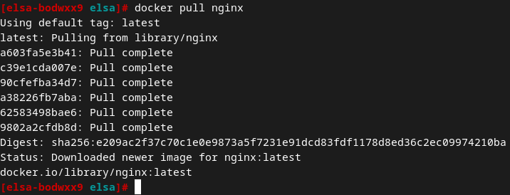

* Проверить наличие докер образа через docker images

* Запустить докер образ через docker run -d [image_id|repository]

* Проверить, что образ запустился через docker ps

* Посмотреть информацию о контейнере через docker inspect [container_id|container_name]

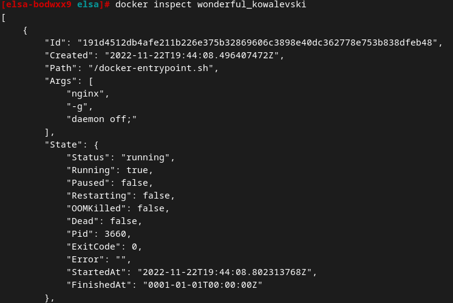

* По выводу команды определить и поместить в отчёт размер контейнера, список замапленных портов и ip контейнера

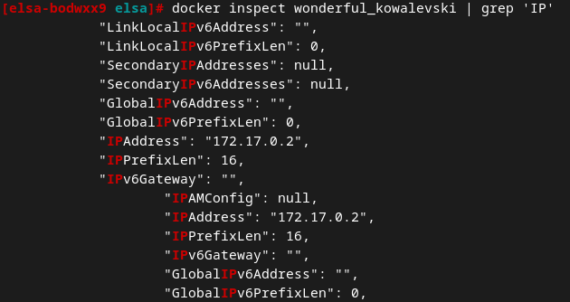

* Остановить докер образ через docker stop [container_id|container_name]

* Проверить, что образ остановился через docker ps

* Запустить докер с замапленными портами 80 и 443 на локальную машину через команду run

* Проверить, что в браузере по адресу localhost:80 доступна стартовая страница nginx

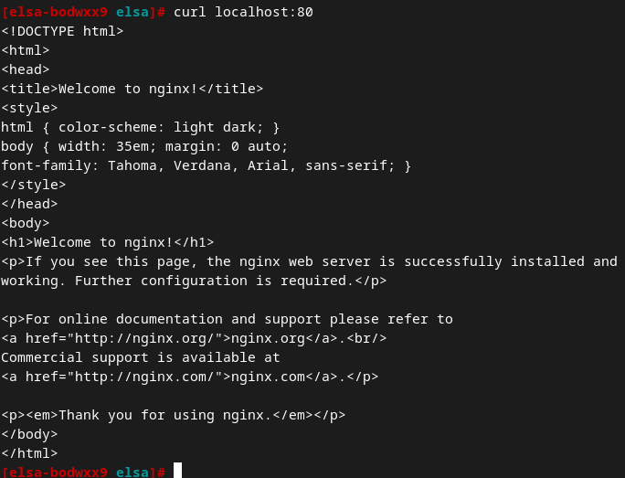

* Перезапустить докер контейнер через docker restart [container_id|container_name]

* Проверить любым способом, что контейнер запустился

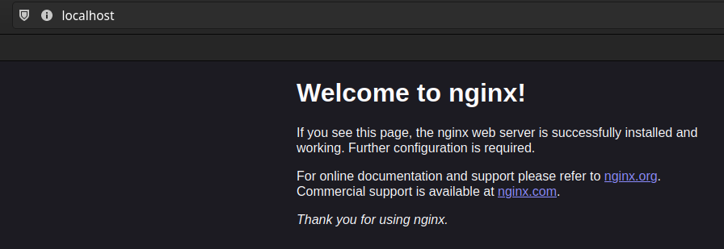

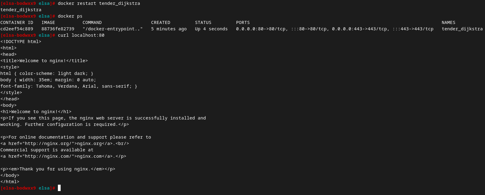

## Part 2. Операции с контейнером

* Прочитать конфигурационный файл nginx.conf внутри докер контейнера через команду exec

* Создать на локальной машине файл nginx.conf

* Настроить в нем по пути /status отдачу страницы статуса сервера nginx

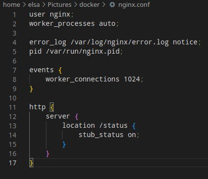

* Скопировать созданный файл nginx.conf внутрь докер образа через команду docker cp

* Перезапустить nginx внутри докер образа через команду exec

* Проверить, что по адресу localhost:80/status отдается страничка со статусом сервера nginx

* Экспортировать контейнер в файл container.tar через команду export

* Остановить контейнер

* Удалить образ через docker rmi [image_id|repository], не удаляя перед этим контейнеры

* Удалить остановленный контейнер

* Импортировать контейнер обратно через команду import

* Запустить импортированный контейнер

* Проверить, что по адресу localhost:80/status отдается страничка со статусом сервера nginx

## Part 3. Мини веб-сервер

* Написать мини сервер на C и FastCgi, который будет возвращать простейшую страничку с надписью Hello World!

* Запустить написанный мини сервер через spawn-fcgi на порту 8080

* Написать свой nginx.conf, который будет проксировать все запросы с 81 порта на 127.0.0.1:8080

* Проверить, что в браузере по localhost:81 отдается написанная вами страничка

* Положить файл nginx.conf по пути ./nginx/nginx.conf (это понадобится позже)

## Part 4. Свой докер

* Написать свой докер образ, который:

* 1) собирает исходники мини сервера на FastCgi из Части 3                                    

* 2) запускает его на 8080 порту                             

* 3) копирует внутрь образа написанный ./nginx/nginx.conf            

* 4) запускает nginx.

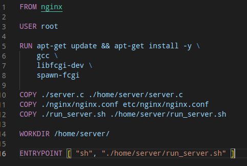

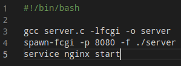

* Собрать написанный докер образ через docker build при этом указав имя и тег                                  

* Проверить через docker images, что все собралось корректно

* Запустить собранный докер образ с маппингом 81 порта на 80 на локальной машине и маппингом папки ./nginx внутрь контейнера по адресу, где лежат конфигурационные файлы nginx'а (см. Часть 2)

* Проверить, что по localhost:80 доступна страничка написанного мини сервера

* Дописать в ./nginx/nginx.conf проксирование странички /status, по которой надо отдавать статус сервера nginx

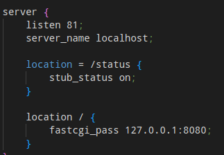

* Перезапустить докер образ

## Part 5. **Dockle**

* Просканировать образ из предыдущего задания через dockle [image_id|repository]

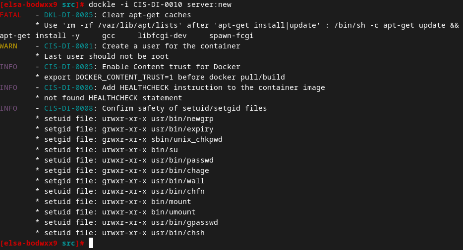

* Исправить образ так, чтобы при проверке через dockle не было ошибок и предупреждений

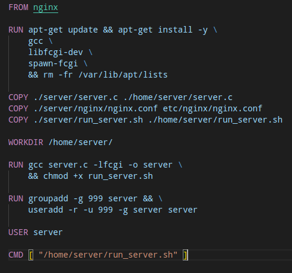

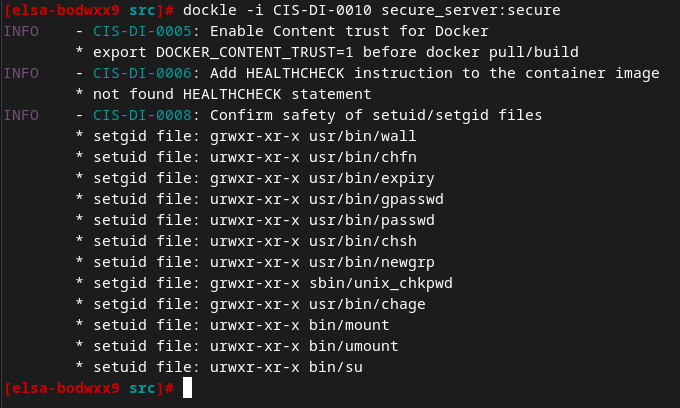

## Part 6. Базовый **Docker Compose**

* Написать файл docker-compose.yml, с помощью которого:

* 1) Поднять докер контейнер из Части 5 (он должен работать в локальной сети, т.е. не нужно использовать инструкцию EXPOSE и мапить порты на локальную машину)

* 2) Поднять докер контейнер с nginx, который будет проксировать все запросы с 8080 порта на 81 порт первого контейнера

* Замапить 8080 порт второго контейнера на 80 порт локальной машины

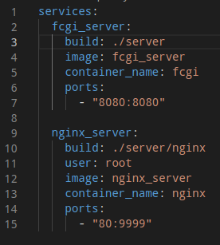

* Остановить все запущенные контейнеры

* Собрать и запустить проект с помощью команд docker-compose build и docker-compose up

* Проверить, что в браузере по localhost:80 отдается написанная вами страничка, как и ранее

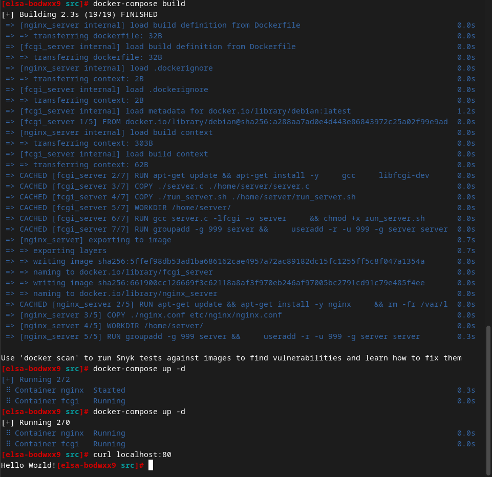
